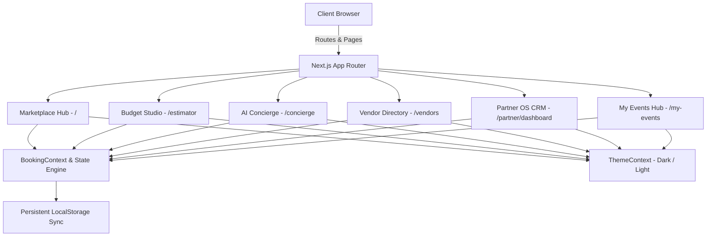

# Architecture Overview: Shata 2.0 Platform

## 1. System Architecture & High-Level Design

Shata 2.0 is designed as a modular, enterprise-ready Single Page Application (SPA) leveraging **Next.js App Router** server-side rendering for search engine crawlers and client-side hydration for high-frequency interactive tools.

---

## 2. State Management Architecture

The platform uses two global React Context providers combined with local reactive hooks:

### A. `BookingContext.tsx`
* **Purpose**: Centralized source of truth for the customer's active event journey, selected service items, guest count changes, pricing simulations, saved vendor wishlists, and milestone progression.
* **Reactive Formula**:
  $$\text{Total Estimate} = \sum (\text{Service Cost}) + \text{GST (18\%)}$$
  $$\text{Escrow Advance} = 20\% \times \text{Total Contract Value}$$
* **Persistence**: Synchronized seamlessly with `localStorage` under `shata_booking_state`, allowing users to navigate between the marketplace, estimator, and AI concierge without losing their selections.

### B. `ThemeContext.tsx`
* **Purpose**: Manages system theme preference, user toggle overrides, and DOM class attachment (`.dark`), ensuring zero hydration mismatch through mounted state guards.

---

## 3. Component Hierarchy & Design System

The component structure is strictly decoupled into **Layout**, **Feature-Specific**, and **Atomic UI** layers:

* **Atomic UI (`/components/ui`)**:
  * `Badge.tsx`: Strict typed visual indicators (`accent`, `gold`, `verified`, `neutral`).
  * `RatingStars.tsx`: Floating-point star renderer with total review metrics.
  * `ThemeToggle.tsx`: Accessible theme switcher with fluid hover feedback.
* **Layout (`/components/layout`)**:
  * `Navbar.tsx`: Sticky glassmorphic top navigation with real-time city selector dropdown, cart counter, theme switch, and mobile drawer.
  * `Footer.tsx`: Sitemap directory, legal entity disclaimers, and partner acquisition banner.
* **Features**:
  * `HeroSection.tsx`: Multi-criteria search form and 3D animated mobile app preview.
  * `BudgetCalculator.tsx`: Dynamic slider-driven computation engine with tier switcher (Silver/Gold/Platinum) and quotation generator.
  * `AIPlannerModal.tsx`: Conversational AI engine generating multi-day itineraries and vendor match recommendations.
  * `PartnerPortal.tsx`: Vendor operating system with Kanban lead pipeline and instant quotation generator.

---

## 4. Accessibility (a11y) & Performance Optimization

* **WCAG AA Compliance**: High-contrast ratios across both light (`#140E0A` on `#FAF8F5`) and dark (`#FFF7F0` on `#0D0906`) modes.
* **Keyboard Navigation**: Focus indicators (`focus:outline-accent`), tab indexing, and Escape-key dismissable modals.
* **Reduced Layout Shift (CLS = 0)**: Pre-dimensioned image containers and font pre-loading with standard fallback font stacks.
* **SEO & Semantic HTML**:
  * Rich JSON-LD `Organization` Schema embedded in `layout.tsx`.
  * OpenGraph and Twitter card metadata configured dynamically per page route.

---

## 5. Scalability & Future Extensibility

* **Backend Handoff**: The client-side state models in `data/*.ts` and `BookingContext.tsx` map directly to standard REST/GraphQL endpoints (e.g. Supabase, PostgreSQL, or Firebase).
* **Payment Integration**: The calculated 20% escrow advance hooks cleanly into Razorpay / Stripe webhook event listeners for instant status progression from `New Inquiry` to `Confirmed Booking`.
