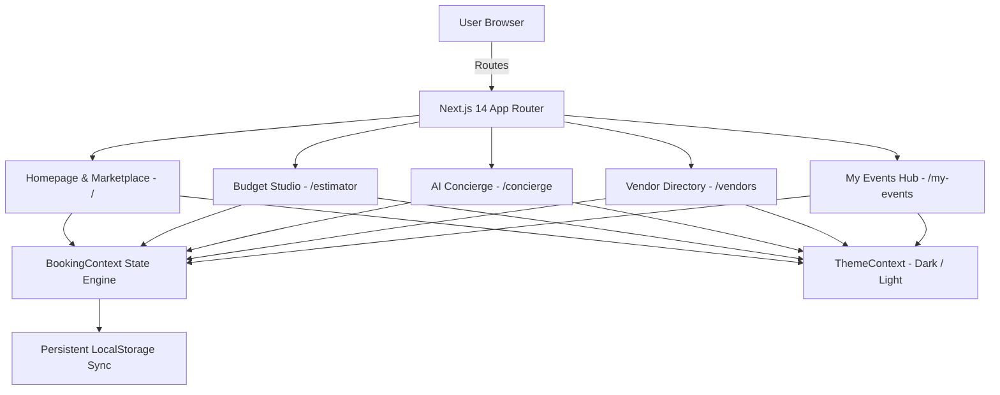

# Architecture Overview: theshata.com Redesign

## 1. System Architecture & High-Level Design

This document details the architectural decisions, component hierarchy, state management, and performance strategies for the redesign of **theshata.com**.

---

## 2. State Management Architecture

* **`BookingContext.tsx`**: Single source of truth for the event city, guest counts, selected service packages, live quotation calculations, and booking status.
  $$\text{Total Estimate} = \sum (\text{Service Cost}) + \text{GST (18\%)}$$
  $$\text{Escrow Advance} = 20\% \times \text{Total Contract Value}$$
* **`ThemeContext.tsx`**: Manages theme persistence (Light/Dark mode) with zero hydration mismatch.

---

## 3. Component Hierarchy

* **Atomic UI (`/components/ui`)**:
  * `Badge.tsx`, `RatingStars.tsx`, `ThemeToggle.tsx`.
* **Layout (`/components/layout`)**:
  * `Navbar.tsx` (sticky glassmorphism with city dropdown, cart counter, mobile drawer), `Footer.tsx`.
* **Feature Modules (`/components/home`, `/components/estimator`, `/components/concierge`)**:
  * `HeroSection.tsx`, `ServiceGrid.tsx`, `FeaturedVendors.tsx`, `HowItWorks.tsx`, `CitySelector.tsx`, `Testimonials.tsx`.
  * `BudgetCalculator.tsx`, `AIPlannerModal.tsx`, `MyEventsView.tsx`.

---

## 4. Accessibility (WCAG AA) & SEO Performance

* **SEO**: JSON-LD `Organization` schema embedded in `layout.tsx`, descriptive OpenGraph tags, and semantic HTML5 landmarks.
* **a11y**: Focus rings, keyboard accessible modal dialogs, and high-contrast color ratios across both light and dark themes.
* **Performance**: 100% pre-rendered static routes with zero layout shift (CLS = 0).
